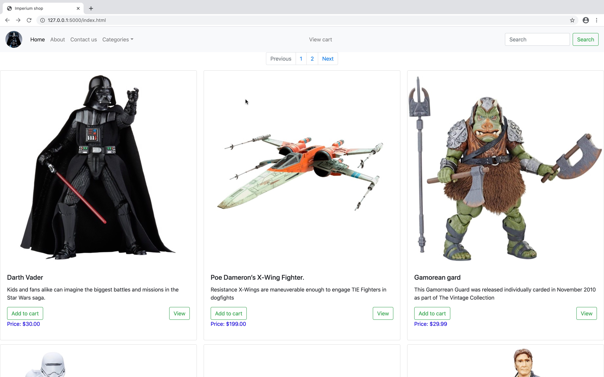

# E-commerce project
This is a simple demo e-commerce store with pre-populated data. It use SQLITE, and the data model an association proxy. All web page are created dynamically using Jinja2, WTForms.

The e-commerce store proposed here sell exclusively vehicles and action figures from the star wars 
franchise. It is catering for both collectors and casual buyer looking to procure vehicle and action 
figures from their favourite franchise.

## Screenshot

## Video Presentation
A short video presentation is accessible [here](http://google.com).

## Requirement

````
click==7.1.2
dnspython==1.16.0
dominate==2.5.1
email-validator==1.1.1
Flask==1.1.2
Flask-Bootstrap==3.3.7.1
Flask-SQLAlchemy==2.4.3
Flask-WTF==0.14.3
idna==2.10
itsdangerous==1.1.0
Jinja2==2.11.2
MarkupSafe==1.1.1
SQLAlchemy==1.3.18
visitor==0.1.3
Werkzeug==1.0.1
WTForms==2.3.1
````
to install each package, use the package manager `pip`:

```
$pip install <package name>
```
## Tree structure of the project:

The following tree structure of the project does not include the virtual environment folder (venv)

``````
.
├── README.md
├── __pycache__
│   └── app.cpython-37.pyc
├── app.py
├── application
│   ├── __init__.py
│   ├── __pycache__
│   │   ├── __init__.cpython-37.pyc
│   │   ├── admin.cpython-37.pyc
│   │   ├── cart.cpython-37.pyc
│   │   ├── model.cpython-37.pyc
│   │   ├── order.cpython-37.pyc
│   │   └── view.cpython-37.pyc
│   ├── admin.py
│   ├── cart
│   │   └── templates
│   │       ├── cart.html
│   │       ├── cartlayout.html
│   │       └── topnav.html
│   ├── cart.py
│   ├── model.py
│   ├── order.py
│   ├── sqlite
│   ├── static
│   │   ├── CSS
│   │   │   └── style.css
│   │   └── IMG
│   │       ├── atw.jpg
│   │       ├── boba.jpg
│   │       ├── bossk.jpg
│   │       ├── darthvader.jpg
│   │       ├── flame.jpg
│   │       ├── gam7.jpg
│   │       ├── han.jpg
│   │       ├── imper.jpg
│   │       ├── jawa.jpg
│   │       ├── manda.jpg
│   │       ├── sithtrooper.jpg
│   │       ├── slave.jpg
│   │       ├── snow.jpg
│   │       ├── storm.jpg
│   │       ├── storm2.jpg
│   │       ├── tatooine.jpg
│   │       ├── tie.jpg
│   │       ├── vader.png
│   │       └── xwing.jpg
│   ├── templates
│   │   ├── about.html
│   │   ├── cat1.html
│   │   ├── cat2.html
│   │   ├── checkout.html
│   │   ├── contact.html
│   │   ├── includes
│   │   │   ├── bottomnav.html
│   │   │   └── topnav.html
│   │   ├── index.html
│   │   ├── item.html
│   │   └── layout.html
│   └── view.py
├── requirement.txt
└── thisapptree.txt

10 directories, 51 files


``````
## Files details
### Python files

- `app.py` call the app in the application folder (`__init__.py`).
- `__init__.py` build the actual app.
- `view.py` handle most of the routes (blueprint viewbp).
- `model.py` handle the data model, and the creation of the database.
- `cart.py` handle specifically the route for the cart (blueprint cartbp). It uses its own templates folder in `application/cart/templates/`. 
- `order.py` handle the checkout form with WTForms.
- `admin.py` handle the loading of the data in the database (blueprint adminbp).
### Pages html
The site:
- Use two base templates: `layout.html` and `cartlayout.html`.
- The includes file are: `bottomnav.html` for the bottom navigation bar, and `topnav.html` for the top navigation bar (also found in `cart/templates`).
- a main index page `index.html` that present all the items for sale. for each item the customer can add to the card or choose to view the particular of the item.
- An about page `about.html`.
- A contact page `contact.html`
- Two categories page `cat1.html` and `cat2.html`, that present only a subset of the items for sell.
- An item page `item.html` that present each item particular.
- A cart page, found in `cart/templates/` `cart.html`.
- And a checkout page `checkout.html`.

## How to update the database

In model.py you need to uncomment `db.drop_all()` see below:

```python
def load_db(db):
    # Drop and re-create all the tables (For testing)
    #db.drop_all()
    db.create_all()
```

```python
def load_db(db):
    # Drop and re-create all the tables (For testing)
    db.drop_all()
    db.create_all()
```
To load the database type in the terminal:

````
$flask run
````
then in your browser go to:
````
http://127.0.0.1:5000/admin/dbseed/
````
you can add more items in admin.py the basic to do this is:

```python
from flask import Blueprint
from sqlalchemy.exc import SQLAlchemyError
from . import db
from application.model import Item

# admin Blueprint
adminbp = Blueprint('admin', __name__, url_prefix='/admin/')

# Data for loading in the database

@adminbp.route('/dbseed/')
@adminbp.route('test')
def dbseed():
    item1 = Item(id=1, name='Darth Vader', image='darthvader.jpg', \
                 description='<p>Kids and fans alike can imagine the biggest battles and missions in the Star Wars saga with figures from The Black Series!</p> <p>With exquisite features and decoration, this series embodies the quality and realism that Star Wars devotees love. Once a heroic Jedi Knight, Darth Vader was seduced by the dark side of the Force, became a Sith Lord, and led the Empire’s eradication of the Jedi Order. He remained in service of the Emperor for decades, enforcing his Master’s will and seeking to crush the fledgling Rebel Alliance.</p> <p> This 6-inch-scale Darth Vader figure is carefully detailed to look like the Sith Lord from Star Wars: A New Hope. This figure features premium detail and multiple points of articulation, and includes a character-specific accessory.</p> <p>Star Wars products are produced by Hasbro under license from Lucasfilm Ltd. Hasbro and all related terms are trademarks of Hasbro.</p>', \
                 itemShort='Kids and fans alike can imagine the biggest battles and missions in the Star Wars saga.',
                 price=30.00, category=2)

    try:
        db.session.add(item1)
        db.session.commit()
    except SQLAlchemyError as e:
        print(e)
        return "<h1>There was an issue adding an item in dbseed function</h1>"
    else:
        return "All Good"    
```
Please note putting html tag in the description field will improve viewing, After Jinja2 rendering.
To enable this I have used `{{ Item.description | safe }}`

## Task list

- [X] Use HTML & Bootstrap CSS.
- [X] Use Flask Templates.
- [X] Use Flask Blueprint.
- [X] Use Flask WTForms.
- [X] Use Flask SQLAlchemy.
- [X] Dynamically create the html pages.
- [X] Item details page.
- [X] Add items to the cart.
- [X] Remove individual item from cart.
- [X] Remove all items from cart.
- [X] View item details from cart by clicking on item picture in cart.
- [X] Checkout form with WTForms that validate data.
- [X] A database with three tables using an association proxy.
- [] Manage the quantity of each item placed in the basket in the database.
- [] Manage the sending of message for the contact us form.
- [] Manage pagination.
- [] implement search.

## License

This is free to use minus the picture that may be copyrighted.